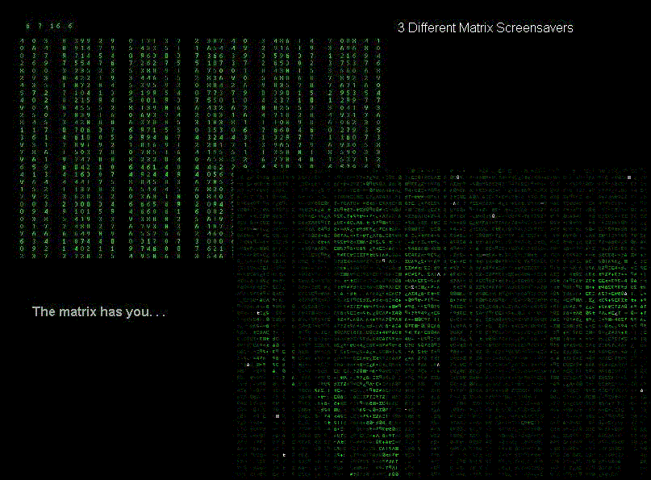



## Matrix Screensavers V1\.139

### Description

3 Realistic Matrix Screensavers like those in the Movie, but without the need of DirectX. The main screensaver is the falling code, it closely emulates the code in the film and also now has the ability to show a picture in the falling code, made out of the text. Reintroduced the frame rate monitor after having difficulties with the last version. The code has been optimised and I get 95-100 FPS on a 500mhz machine! The other screensavers are call tracing, which can trace a given number or a random telephone number, and finally the scene in the film when Neo wakes up at his computer... Knock Knock Neo... <Updated 3rd Nov> Include Option Explicit, Frame Rate Limiter and edited code to increase performance <Updated 7th Nov> After Having some free time I altered the code so now the falling code can be either Red, Green or Blue
 
### More Info
 

             |
---                |---
**Submitted On**   |2002-11-04 20:36:58
**By**             |[Kevin Pfister](https://github.com/Planet-Source-Code/PSCIndex/blob/master/ByAuthor/kevin-pfister.md)
**Level**          |Advanced
**User Rating**    |4.4 (225 globes from 51 users)
**Compatibility**  |VB 6\.0
**Category**       |[Graphics](https://github.com/Planet-Source-Code/PSCIndex/blob/master/ByCategory/graphics__1-46.md)
**World**          |[Visual Basic](https://github.com/Planet-Source-Code/PSCIndex/blob/master/ByWorld/visual-basic.md)
**Archive File**   |[Matrix\_Scr1493491172002\.zip](https://github.com/Planet-Source-Code/kevin-pfister-matrix-screensavers-v1-139__1-40314/archive/master.zip)

